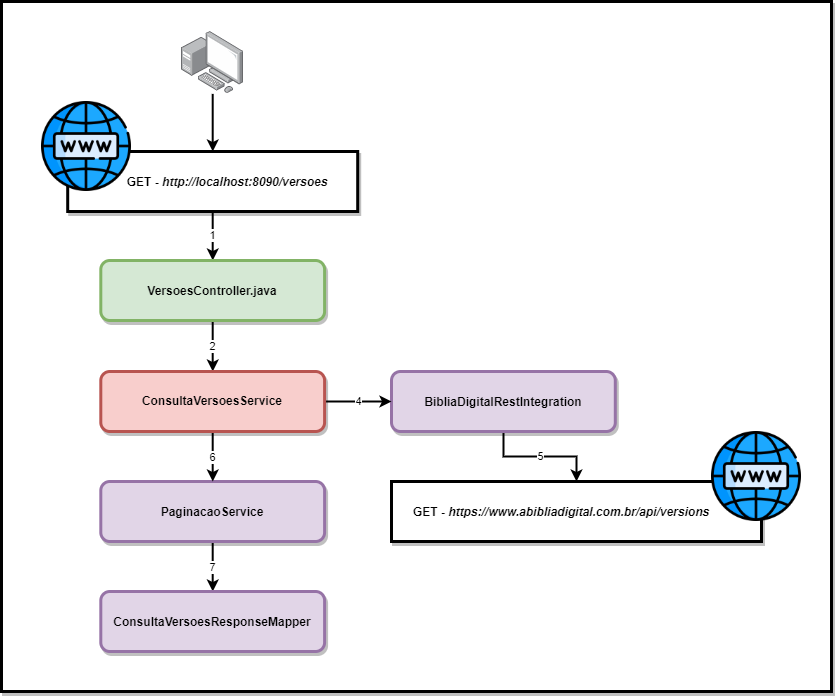

# Jesus API

### Decrição
Projeto de manuseio e distribuição de serviços para aplicativos cristãos.

---

### Container(s):
```text
- REDIS -> docker run -d --name redis -p 6379:6379 redis
```

#### Executando redis-cli no container `redis`:
Após a execução do comando que roda o container `redis` no item **Container(s)** deve se executar o seguinte comando:
```text
docker exec -it redis bash
```

Assim você estará dentro do container do redis e poderá executar:
````text
redis-cli
````

Após isto alguns comandos que podem ser úteis:
- keys * -> lista as chaves atuais salvas no redis;
- get CHAVE -> lista as propriedades da chave informada;
- del CHAVE, ...CHAVE -> exclui as chaves informadas;

---

### Collections

A collections utilizadas em desenvolvimento para testes funcionais se encontram na pasta `/Collections`:
- [POSTMAN_COLLECTION_V2](Collections/JESUS WEB APP.postman_collection_v2.json)
- [POSTMAN_COLLECTION_V2.1](Collections/JESUS WEB APP.postman_collection_v2.1.json)

**Obs:** foram colocadas as collections em `v2` e `v2.1` do Postman para evitar incompatibilidade de versão :)

---

### Serviços

#### [PAGINADO]Consulta de Livros da Bíblia
- Controller: **LivrosController**
- Endpoint: **GET** - `http://localhost:8090/jesus-api/livros/{index}/{numeroItens}`

- **Path Variable(s)**:
    - index - Integer - _Número da página_
    - numeroItens - Integer - _Número de itens por página_

- **Response**:
```json
{
    "index": 0,
    "numeroItens": 3,
    "itens": [
        {
            "abreviacao": {
                "portugues": "gn",
                "ingles": "gn"
            },
            "autor": "Moisés",
            "numeroCapitulos": 50,
            "grupo": "Pentateuco",
            "testamento": "VT",
            "nome": "Gênesis"
        },
        {...}
    ],
    "primeiraPagina": true,
    "ultimaPagina": false
}
```

- Diagrama:


#### Consulta de Livro da Bíblia Por Abreviação
- Controller: **LivrosController**
- Endpoint: **GET** - `http://localhost:8090/jesus-api/livros/{abreviacao}`

- **Path Variable(s)**: 
   - abreviacao - String - _Dado fornecido no endpoint de listagem de livros_ 

- **Response**:
```json
{
    "abreviacao": {
        "portugues": "gn",
        "ingles": "gn"
    },
    "autor": "Moisés",
    "numeroCapitulos": 50,
    "comentario": "Autor: Uma vez que este livro anônimo integra o Pentateuco unificado,...",
    "grupo": "Pentateuco",
    "nome": "Gênesis",
    "testamento": "VT"
}
```

- Diagrama:


#### [PAGINADO]Consulta de Versões da Bíblia
- Controller: **VersoesController**
- Endpoint: **GET** - `http://localhost:8090/jesus-api/versoes/{index}/{numeroItens}`

- **Path Variable(s)**:
  - index - Integer - _Número da página_
  - numeroItens - Integer - _Número de itens por página_

- **Response**:
```json
{
  "index": 1,
  "numeroItens": 3,
  "itens": [
    {
      "codigoVersao": "kjv",
      "numeroVersos": 31101,
      "nomeCompleto": "King James Version",
      "descricao": "A bíblia King James possui uma das traduções mais fiéis aos textos hebraicos e gregos, os quais foram escritos centenas de anos atrás. O trabalho de tradução dessa versão bíblica começou em 1603, sendo finalizada e publicada em 1611. Muitas outras foram baseadas na King James, por se tratar de uma obra confiável e, então, ser uma ótima opção de embasamento."
    },
    {...}
  ],
  "primeiraPagina": false,
  "ultimaPagina": false
}
```

- Diagrama:



#### Consulta de Capítulo
- Controller: **CapitulosController**
- Endpoint: **GET** - `http://localhost:8090/jesus-api/capitulos/{versao}/{abreviacao}/{capitulo}`

- **Path Variable(s)**:
  - versao - String - _Dado fornecido no endpoint de listagem de versões_
  - abreviacao - String - _Dado fornecido no endpoint de listagem de livros, ou consulta de livro_
  - capitulo - Integer - _Dado fornecido na consulta do livro_

- **Response**:
```json
{
  "livro": {
    "abreviacao": {
      "portugues": "gn",
      "ingles": "gn"
    },
    "nome": "Gênesis",
    "autor": "Moisés",
    "grupo": "Pentateuco",
    "versao": "nvi"
  },
  "capitulo": {
    "numero": 1,
    "quantidadeVersos": 31
  },
  "versos": [
    {
      "numero": 1,
      "texto": "No princípio Deus criou os céus e a terra."
    },
    {...}
  ]
}
```

- Diagrama:
  


#### Consulta de Verso Aleatório
- Controller: **VersosController**
- Endpoint: **GET** - `http://localhost:8090/jesus-api/versos/{versao}/aleatorio`

- **Path Variable(s)**:
  - versao - String - _Dado fornecido no endpoint de listagem de versões_

- **Response**:
```json
{
  "livro": {
    "abreviacao": {
      "portugues": "gn",
      "ingles": "gn"
    },
    "nome": "Gênesis",
    "autor": "Moisés",
    "grupo": "Pentateuco",
    "versao": "nvi"
  },
  "numeroCapitulo": 1,
  "numeroVerso": 1,
  "texto": "No princípio Deus criou os céus e a terra."
}
```

- Diagrama:
  


#### [PAGINADO]Consulta de Versos por palavra
- Controller: **VersosController**
- Endpoint: **GET** - `http://localhost:8090/jesus-api/versos/pesquisa/{index}/{numeroItens}`

- **Path Variable(s)**:
  - index - Integer - _Número da página_
  - numeroItens - Integer - _Número de itens por página_

- **Request**:
```json
{
  "versao": "nvi",
  "palavra": "eliseu"
}
```

- **Response**:
```json
{
  "index": 0,
  "numeroItens": 3,
  "itens": [
    {
      "livro": {
        "abreviacao": {
          "portugues": "2rs",
          "ingles": "2kgs"
        },
        "autor": "Jeremias",
        "numeroCapitulos": 25,
        "grupo": "Históricos",
        "nome": "2º Reis",
        "testamento": "VT"
      },
      "numeroCapitulo": 2,
      "numeroVerso": 12,
      "texto": "Quando viu isso, Eliseu gritou: \"Meu pai! Meu pai! Tu eras como os carros de guerra e os cavaleiros de Israel! \" E quando já não podia mais vê-lo, Eliseu pegou as próprias vestes e as rasgou ao meio."
    },
    {...}
  ],
  "primeiraPagina": true,
  "ultimaPagina": false
}
```

- Diagrama:
  
